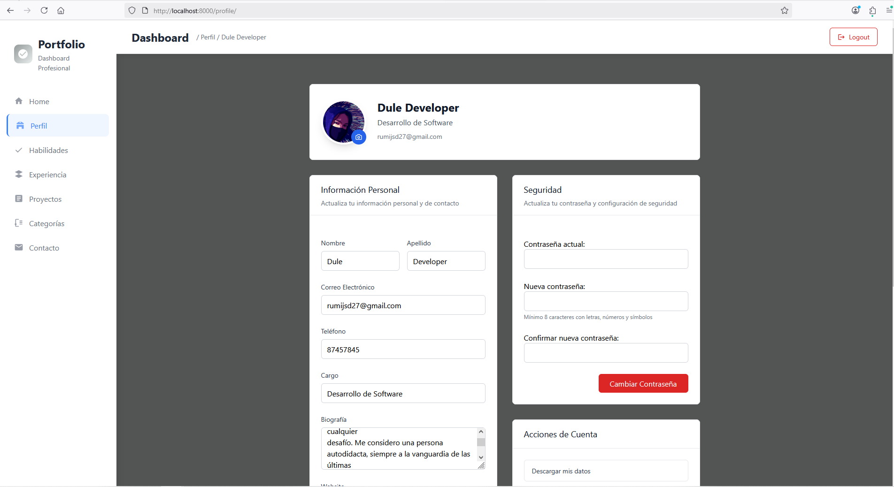

# PortfolioHub

Plataforma web donde los usuarios pueden crear, personalizar y gestionar su portafolio profesional desde un dashboard moderno e interactivo.

---

## Descripción

PortfolioHub permite a los usuarios diseñar su portafolio personal de manera sencilla y visual. Cada usuario tiene un dashboard donde puede:

* Añadir secciones como Experiencia, Habilidades y Proyectos.
* Personalizar el diseño y la apariencia de su portafolio.
* Compartir su portafolio profesional con un enlace único.

El objetivo de PortfolioHub es **facilitar la creación de portafolios profesionales sin necesidad de conocimientos técnicos**, ofreciendo una experiencia intuitiva y elegante para cualquier usuario.

---

## Requisitos

* Python 3.11.2
* Django 5.2
* Gunicorn 21.2.0

---

## Instalación y configuración

1. Clona el repositorio:

```bash
git clone https://github.com/rjsd-dule/portafolio.git
cd portafolio
```

2. Instala las dependencias del proyecto:

```bash
pip install -r requirements.txt
```

3. Aplica las migraciones de la aplicación:

```bash
python manage.py makemigrations app
python manage.py migrate
```

## Ejecución en local

```bash
python manage.py runserver
```

Abre tu navegador en: `http://127.0.0.1:8000/`

---
## Ejecución con Docker (opcional)

Este proyecto incluye un archivo `Dockerfile` para facilitar su despliegue en contenedores. Si prefieres ejecutar la aplicación usando Docker, sigue estos pasos:

1. **Construye la imagen del contenedor:**

   ```bash
   docker build -t portafolio .
   ```

2. **Ejecuta el contenedor:**

   ```bash
   docker run -p 8000:8000 portafolio
   ```

La aplicación estará disponible en `http://localhost:8000/`.

---

## Estructura del proyecto

```plaintext
portafolio/                    # Carpeta principal del proyecto
├── app/                       # Aplicación principal
│   ├── backends/
│   │   └── email_backend.py
│   ├── forms/
│   │   ├── CategoryForm.py
│   │   ├── ExperienceForm.py
│   │   └── LoginForm.py
│   │   └── otros_form.py
│   ├── middleware/
│   │   └── security.py
│   ├── models/
│   │   └── (tus archivos de modelos)
│   ├── static/
│   │   ├── css/
│   │   ├── js/
│   │   └── images/
│   ├── templates/
│   │   └── (archivos HTML)
│   ├── utils/
│   ├── views/
│   │   ├── auth.py
│   │   ├── change_password.py
│   │   └── experience.py
│   │   └── otras_vistas.py
├── portafolio/                # Configuración global del proyecto
│   ├── __init__.py
│   ├── settings.py
│   ├── urls.py
│   ├── wsgi.py
│   └── asgi.py
├── manage.py
├── requirements.txt
├── Dockerfile
└── .gitignore
```
## Estructura del proyecto

* **Despliegue**: Compatible con Docker para entornos de desarrollo
* **Arquitectura**: Patrón MVT (Model-View-Template) de Django
* **Organización**: 
  - Aplicación principal modular con separación de concerns
  - Backends personalizados para email
  - Middleware de seguridad personalizado
  - Formularios organizados por funcionalidad
* **Configuración**: Settings separados para desarrollo y producción

## Imagen

> http://127.0.0.1:8000/login.

